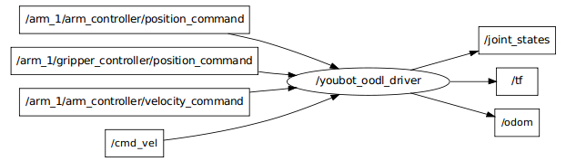

# Node [/youbot_oodl_driver]

## Publications: 
 * /joint_states [sensor_msgs/JointState]
 * /rosout [rosgraph_msgs/Log]
 * /tf [tf/tfMessage]
 * /odom [nav_msgs/Odometry]

## Subscriptions: 
 * /arm_1/gripper_controller/position_command [unknown type]
 * /arm_1/arm_controller/position_command [unknown type]
 * /cmd_vel [unknown type]
 * /arm_1/arm_controller/velocity_command [unknown type]

## Services: 
 * /reconnect
 * /base/switchOffMotors
 * /arm_1/switchOnMotors
 * /youbot_oodl_driver/get_loggers
 * /arm_1/switchOffMotors
 * /arm_1/calibrate
 * /base/switchOnMotors
 * /youbot_oodl_driver/set_logger_level

## Connections:
 * topic: /rosout
    * to: /rosout
    * direction: outbound
    * transport: TCPROS
 
## Ros Node Rate

The rate for the youbot_oodl_node is currently hardcoded to 50Hz in youbot_oodl.cpp. 
There is currently no service to change the rate on the run and there is no functionality to specify the rate at startup.
The YouBot controller can take commands witha frecuency of 1kHz.
 

